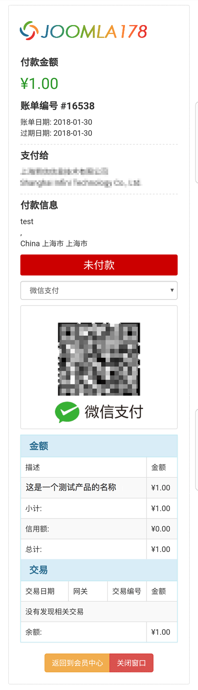

WHMCS invoice template
===

The invoice template in WHMCS is too ugly.

## USAGE

* Replace the file `viewinvoice.tpl` in your template folder;
* To ensure that the CSS file `invoice.css` reference path is correct;
* ** Base on bootstrap style **;
* Compatible with WHMCS6 and WHMCS7, because of Invoice template is relatively simple, if you want to be compatible with WHMCS5, you should only need to modify some main variables;

Enjoy!

## DEMO

## License

The MIT License (MIT)